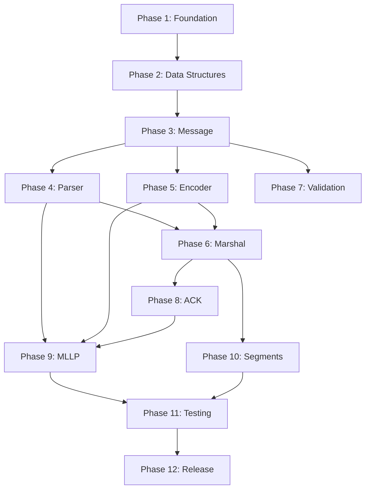

# GoLevel7 v2 - Implementation Plan

## Overview

This document outlines the phased implementation plan for GoLevel7 v2. The plan is structured to build foundational components first, with each phase building upon the previous. Each phase has clear deliverables and can be tested independently.

---

## Phase 1: Project Foundation

### 1.1 Project Setup

**Objective**: Establish project structure, tooling, and development workflow.

**Tasks**:
1. Initialize Go module (`go mod init github.com/dshills/golevel7v2`)
2. Create directory structure per specification
3. Set up linting configuration (golangci-lint)
4. Configure CI/CD pipeline (GitHub Actions)
5. Set up pre-commit hooks
6. Create Makefile with common targets

**Directory Structure**:
```
golevel7v2/
├── go.mod
├── go.sum
├── Makefile
├── .golangci.yml
├── .github/
│   └── workflows/
│       ├── ci.yml
│       └── release.yml
├── hl7/
├── parse/
├── encode/
├── marshal/
├── validate/
├── ack/
├── mllp/
├── segments/
├── internal/
├── testdata/
├── specs/
└── plans/
```

**Deliverables**:
- [ ] Working Go module
- [ ] CI pipeline running tests and linting
- [ ] Makefile with `test`, `lint`, `build`, `bench` targets

---

### 1.2 Core Domain Types (hl7 package)

**Objective**: Implement foundational types that all other packages depend on.

**Tasks**:

#### 1.2.1 Delimiters
```go
// File: hl7/delimiters.go
- Delimiters struct
- DefaultDelimiters() function
- ParseDelimiters() function
- String() method
- Unit tests
```

#### 1.2.2 Location
```go
// File: hl7/location.go
- Location struct
- ParseLocation() function
- String() method
- IsValid() method
- Unit tests for all location formats:
  - "PID"
  - "PID.5"
  - "PID.5.1"
  - "PID.5.1.2"
  - "PID[0].5"
  - "PID.5[0].1"
```

#### 1.2.3 Errors
```go
// File: hl7/errors.go
- ParseError struct
- LocationError struct
- ValidationError struct
- Severity constants
- Error interface implementations
- Sentinel errors (ErrInvalidLocation, ErrSegmentNotFound, etc.)
```

**Deliverables**:
- [ ] `hl7/delimiters.go` with tests
- [ ] `hl7/location.go` with tests
- [ ] `hl7/errors.go` with tests
- [ ] 100% test coverage for Phase 1.2

---

## Phase 2: Core Data Structures

### 2.1 SubComponent Implementation

**Objective**: Implement the atomic data unit.

**File**: `hl7/subcomponent.go`

**Tasks**:
1. Define SubComponent struct
2. Implement SubComponent interface methods
3. Implement Bytes() encoding
4. Unit tests

```go
type subComponent struct {
    value []rune
}

func NewSubComponent(value string) SubComponent
func (s *subComponent) Value() string
func (s *subComponent) Set(value string) error
func (s *subComponent) Bytes(delims *Delimiters) []byte
func (s *subComponent) String() string
```

---

### 2.2 Component Implementation

**Objective**: Implement component with subcomponent management.

**File**: `hl7/component.go`

**Tasks**:
1. Define Component struct
2. Implement Component interface methods
3. Parse subcomponents from raw data
4. Encode back to bytes
5. Unit tests

```go
type component struct {
    subComponents []SubComponent
    raw           []rune
}

func NewComponent(value string) Component
func ParseComponent(data []rune, delims *Delimiters) (Component, error)
func (c *component) Value() string
func (c *component) SubComponent(index int) (SubComponent, bool)
func (c *component) SubComponents() []SubComponent
func (c *component) Set(value string) error
func (c *component) SetSubComponent(index int, value string) error
func (c *component) Bytes(delims *Delimiters) []byte
```

---

### 2.3 Repetition Implementation

**Objective**: Implement field repetition handling.

**File**: `hl7/repetition.go`

**Tasks**:
1. Define Repetition struct
2. Implement Repetition interface methods
3. Parse components from raw data
4. Unit tests

```go
type repetition struct {
    components []Component
    raw        []rune
}

func NewRepetition(value string) Repetition
func ParseRepetition(data []rune, delims *Delimiters) (Repetition, error)
func (r *repetition) Value() string
func (r *repetition) Component(index int) (Component, bool)
func (r *repetition) Components() []Component
func (r *repetition) Bytes(delims *Delimiters) []byte
```

---

### 2.4 Field Implementation

**Objective**: Implement field with repetition support.

**File**: `hl7/field.go`

**Tasks**:
1. Define Field struct
2. Implement Field interface methods
3. Handle repetition parsing and encoding
4. MSH field special handling (MSH-1, MSH-2)
5. Unit tests

```go
type field struct {
    seqNum      int
    repetitions []Repetition
    raw         []rune
}

func NewField(seq int, value string) Field
func ParseField(seq int, data []rune, delims *Delimiters) (Field, error)
func (f *field) SeqNum() int
func (f *field) Value() string
func (f *field) Component(index int) (Component, bool)
func (f *field) Components() []Component
func (f *field) Repetition(index int) (Repetition, bool)
func (f *field) Repetitions() []Repetition
func (f *field) RepetitionCount() int
func (f *field) Get(location string) (string, error)
func (f *field) Set(location string, value string) error
func (f *field) Bytes(delims *Delimiters) []byte
```

---

### 2.5 Segment Implementation

**Objective**: Implement segment with field management.

**File**: `hl7/segment.go`

**Tasks**:
1. Define Segment struct
2. Implement Segment interface methods
3. MSH segment special parsing (delimiter extraction)
4. Field sequence number handling
5. Unit tests with focus on MSH

```go
type segment struct {
    name   string
    fields []Field
    raw    []rune
}

func NewSegment(name string) Segment
func ParseSegment(data []rune, delims *Delimiters) (Segment, error)
func (s *segment) Name() string
func (s *segment) Field(seq int) (Field, bool)
func (s *segment) Fields(seq int) []Field
func (s *segment) AllFields() []Field
func (s *segment) FieldCount() int
func (s *segment) Get(location string) (string, error)
func (s *segment) GetAll(location string) ([]string, error)
func (s *segment) Set(location string, value string) error
func (s *segment) SetField(seq int, field Field) error
func (s *segment) AddField(field Field) error
func (s *segment) Bytes(delims *Delimiters) []byte
```

**Deliverables for Phase 2**:
- [ ] All data structure files with full interface implementations
- [ ] Comprehensive unit tests
- [ ] Benchmark tests for parsing and encoding
- [ ] Documentation with examples

---

## Phase 3: Message Implementation

### 3.1 Message Core

**Objective**: Implement the Message type with full query and manipulation capabilities.

**File**: `hl7/message.go`

**Tasks**:
1. Define Message struct
2. Implement Message interface methods
3. Segment management (add, insert, remove)
4. Query interface (Get, GetAll, Set)
5. Location-based access (GetAt, SetAt)
6. Metadata extraction (Type, ControlID, Version)
7. Unit tests

```go
type message struct {
    segments   []Segment
    delimiters *Delimiters
    raw        []byte
}

func NewMessage() Message
func (m *message) Segment(name string) (Segment, bool)
func (m *message) Segments(name string) []Segment
func (m *message) AllSegments() []Segment
func (m *message) Get(location string) (string, error)
func (m *message) GetAll(location string) ([]string, error)
func (m *message) Set(location string, value string) error
func (m *message) GetAt(loc *Location) (string, error)
func (m *message) GetAllAt(loc *Location) ([]string, error)
func (m *message) SetAt(loc *Location, value string) error
func (m *message) AddSegment(seg Segment) error
func (m *message) InsertSegment(index int, seg Segment) error
func (m *message) RemoveSegment(name string) bool
func (m *message) Bytes() []byte
func (m *message) String() string
func (m *message) Type() string
func (m *message) ControlID() string
func (m *message) Version() string
func (m *message) Delimiters() *Delimiters
```

---

### 3.2 Escape Sequence Handling

**Objective**: Implement proper HL7 escape sequence encoding/decoding.

**File**: `internal/escape/escape.go`

**Tasks**:
1. Implement Escaper interface
2. Handle all standard escape sequences
3. Handle hex encoding (\Xdd\)
4. Handle custom escape sequences
5. Unit tests for all sequences

```go
type escaper struct {
    delims *hl7.Delimiters
}

func New(delims *hl7.Delimiters) hl7.Escaper
func (e *escaper) Escape(value string, delims *hl7.Delimiters) string
func (e *escaper) Unescape(value string, delims *hl7.Delimiters) string
```

**Test Cases**:
- `\F\` -> `|`
- `\S\` -> `^`
- `\T\` -> `&`
- `\R\` -> `~`
- `\E\` -> `\`
- `\X0D\` -> `\r`
- `\.br\` -> `\n`
- Nested escapes
- Invalid sequences (error handling)

**Deliverables for Phase 3**:
- [ ] Complete Message implementation
- [ ] Escape sequence handling
- [ ] Integration tests with real HL7 messages
- [ ] Query interface tests

---

## Phase 4: Parser Implementation

### 4.1 Lexer

**Objective**: Implement tokenization of HL7 messages.

**File**: `parse/lexer.go`

**Tasks**:
1. Define token types
2. Implement lexer with rune-by-rune scanning
3. Handle segment terminator detection
4. Handle MLLP framing removal
5. Unit tests

```go
type TokenType int

const (
    TokenSegment TokenType = iota
    TokenField
    TokenComponent
    TokenSubComponent
    TokenRepetition
    TokenEOF
    TokenError
)

type Token struct {
    Type  TokenType
    Value []rune
    Pos   int
}

type Lexer struct {
    input  []rune
    pos    int
    delims *hl7.Delimiters
}

func NewLexer(input []byte, delims *hl7.Delimiters) *Lexer
func (l *Lexer) NextToken() Token
func (l *Lexer) Peek() Token
```

---

### 4.2 Parser Core

**Objective**: Implement the main parser.

**File**: `parse/parser.go`

**Tasks**:
1. Implement Parser interface
2. Parse MSH segment first to extract delimiters
3. Parse remaining segments
4. Build Message structure
5. Error handling with location information
6. Unit tests

```go
type parser struct {
    config parserConfig
}

func New(opts ...ParserOption) Parser
func (p *parser) Parse(data []byte) (hl7.Message, error)
func (p *parser) ParseContext(ctx context.Context, data []byte) (hl7.Message, error)
```

---

### 4.3 Parser Options

**File**: `parse/options.go`

**Tasks**:
1. Define parserConfig struct
2. Implement all ParserOption functions
3. Default configuration
4. Validation of options

```go
type parserConfig struct {
    strictMode          bool
    allowEmptySegments  bool
    customDelimiters    *hl7.Delimiters
    maxSegments         int
    maxFieldLength      int
    segmentTerminator   rune
}

func WithStrictMode(strict bool) ParserOption
func WithAllowEmptySegments(allow bool) ParserOption
func WithCustomDelimiters(d *hl7.Delimiters) ParserOption
func WithMaxSegments(max int) ParserOption
func WithMaxFieldLength(max int) ParserOption
func WithSegmentTerminator(term rune) ParserOption
```

---

### 4.4 Scanner

**Objective**: Implement streaming message parsing.

**File**: `parse/scanner.go`

**Tasks**:
1. Implement Scanner interface
2. Handle MLLP framing
3. Memory-efficient streaming
4. Error recovery
5. Unit tests

```go
type scanner struct {
    reader  io.Reader
    parser  Parser
    current hl7.Message
    err     error
    buf     []byte
}

func NewScanner(r io.Reader, opts ...ParserOption) Scanner
func (s *scanner) Scan() bool
func (s *scanner) Message() hl7.Message
func (s *scanner) Err() error
```

**Deliverables for Phase 4**:
- [ ] Lexer with full tokenization
- [ ] Parser with all options
- [ ] Scanner for streaming
- [ ] Fuzz tests for parser robustness
- [ ] Benchmark comparisons with v1

---

## Phase 5: Encoder Implementation

### 5.1 Encoder Core

**Objective**: Implement message encoding to bytes.

**File**: `encode/encoder.go`

**Tasks**:
1. Implement Encoder interface
2. Proper delimiter handling
3. MSH segment special encoding
4. Empty field/component handling
5. Unit tests

```go
type encoder struct {
    config encoderConfig
}

func New(opts ...EncoderOption) Encoder
func (e *encoder) Encode(msg hl7.Message) ([]byte, error)
func (e *encoder) EncodeToWriter(ctx context.Context, w io.Writer, msg hl7.Message) error
```

---

### 5.2 Encoder Options

**File**: `encode/options.go`

```go
type encoderConfig struct {
    lineEnding          string
    includeMLLP         bool
    trailingDelimiters  bool
}

func WithLineEnding(ending string) EncoderOption
func WithMLLP(enable bool) EncoderOption
func WithTrailingDelimiters(include bool) EncoderOption
```

---

### 5.3 Writer

**Objective**: Implement streaming message writer.

**File**: `encode/writer.go`

**Tasks**:
1. Implement Writer interface
2. Buffered writing
3. MLLP framing
4. Unit tests

```go
type writer struct {
    w       io.Writer
    encoder Encoder
    buf     *bytes.Buffer
}

func NewWriter(w io.Writer, opts ...EncoderOption) Writer
func (w *writer) Write(msg hl7.Message) error
func (w *writer) Flush() error
func (w *writer) Close() error
```

**Deliverables for Phase 5**:
- [ ] Encoder with all options
- [ ] Writer for streaming
- [ ] Round-trip tests (parse -> encode -> parse)
- [ ] MLLP framing tests

---

## Phase 6: Marshal/Unmarshal Implementation

### 6.1 Tag Parser

**Objective**: Parse struct tags for HL7 mapping.

**File**: `marshal/tags.go`

**Tasks**:
1. Parse `hl7` struct tags
2. Support all tag options
3. Handle nested structs
4. Handle slices for repetitions
5. Unit tests

```go
type tagInfo struct {
    location    string
    omitEmpty   bool
    timeFormat  string
    ignore      bool
}

func parseTag(tag string) (*tagInfo, error)
```

---

### 6.2 Unmarshaler

**Objective**: Populate Go structs from HL7 messages.

**File**: `marshal/unmarshal.go`

**Tasks**:
1. Implement Unmarshaler interface
2. Reflection-based field population
3. Type conversion (string, int, float, time.Time, bool)
4. Slice handling for repetitions
5. Nested struct support
6. Error handling for missing fields
7. Unit tests

```go
type unmarshaler struct {
    config marshalConfig
}

func NewUnmarshaler(opts ...MarshalOption) Unmarshaler
func (u *unmarshaler) Unmarshal(msg hl7.Message, v interface{}) error
```

---

### 6.3 Marshaler

**Objective**: Convert Go structs to HL7 messages.

**File**: `marshal/marshal.go`

**Tasks**:
1. Implement Marshaler interface
2. Reflection-based message building
3. Type conversion to strings
4. Slice handling for repetitions
5. Nested struct support
6. Unit tests

```go
type marshaler struct {
    config marshalConfig
}

func NewMarshaler(opts ...MarshalOption) Marshaler
func (m *marshaler) Marshal(v interface{}) (hl7.Message, error)
func (m *marshaler) MarshalInto(msg hl7.Message, v interface{}) error
```

---

### 6.4 Marshal Options

**File**: `marshal/options.go`

```go
type marshalConfig struct {
    tagName      string
    omitEmpty    bool
    timeFormat   string
    timeLocation *time.Location
}

func WithTagName(name string) MarshalOption
func WithOmitEmpty(omit bool) MarshalOption
func WithTimeFormat(format string) MarshalOption
func WithTimeLocation(loc *time.Location) MarshalOption
```

**Deliverables for Phase 6**:
- [ ] Tag parser with all options
- [ ] Unmarshaler with type conversion
- [ ] Marshaler with struct building
- [ ] Round-trip tests (marshal -> unmarshal)
- [ ] Edge case handling (nil pointers, empty slices)

---

## Phase 7: Validation Implementation

### 7.1 Rule Types

**Objective**: Implement validation rule infrastructure.

**File**: `validate/rules.go`

**Tasks**:
1. Define Rule interface
2. Implement rule types (required, value, pattern, length, oneOf)
3. Custom rule support
4. Unit tests

```go
type requiredRule struct {
    location string
}

type valueRule struct {
    location string
    expected string
}

type patternRule struct {
    location string
    pattern  *regexp.Regexp
}

type lengthRule struct {
    location string
    min, max int
}

type oneOfRule struct {
    location string
    allowed  []string
}

type customRule struct {
    location string
    fn       func(string) error
}
```

---

### 7.2 Rule Builder

**Objective**: Implement fluent rule construction.

**File**: `validate/builder.go`

**Tasks**:
1. Implement RuleBuilder interface
2. Fluent API
3. Rule composition
4. Unit tests

```go
type ruleBuilder struct {
    location string
    rules    []Rule
}

func At(location string) RuleBuilder
func (b *ruleBuilder) Required() RuleBuilder
func (b *ruleBuilder) Value(expected string) RuleBuilder
func (b *ruleBuilder) Pattern(pattern string) RuleBuilder
func (b *ruleBuilder) Length(min, max int) RuleBuilder
func (b *ruleBuilder) OneOf(values ...string) RuleBuilder
func (b *ruleBuilder) Custom(fn func(value string) error) RuleBuilder
func (b *ruleBuilder) Build() Rule
```

---

### 7.3 Validator

**Objective**: Implement message validation.

**File**: `validate/validator.go`

**Tasks**:
1. Implement Validator interface
2. Apply rules to messages
3. Collect all validation errors
4. Support warning vs error severity
5. Unit tests

```go
type validator struct {
    rules  []Rule
    config validatorConfig
}

func New(rules ...Rule) Validator
func (v *validator) Validate(msg hl7.Message) ValidationResult
func (v *validator) ValidateSegment(seg hl7.Segment) ValidationResult
```

---

### 7.4 Pre-built Rulesets

**Objective**: Provide common validation rulesets.

**File**: `validate/ruleset.go`

**Tasks**:
1. Define RuleSet interface
2. Implement MSH rules
3. Implement PID rules
4. Implement PV1 rules
5. Implement common message type rules
6. Unit tests

```go
func MSHRules() RuleSet
func PIDRules() RuleSet
func PV1Rules() RuleSet
func ORMRules() RuleSet
func ORURules() RuleSet
func ADTRules() RuleSet
```

**Deliverables for Phase 7**:
- [ ] All rule types implemented
- [ ] Rule builder with fluent API
- [ ] Validator with result aggregation
- [ ] Pre-built rulesets
- [ ] Custom rule examples

---

## Phase 8: ACK/NAK Implementation

### 8.1 ACK Types

**Objective**: Define acknowledgment structures.

**File**: `ack/types.go`

**Tasks**:
1. Define AckCode constants
2. Define ACK struct
3. Unit tests

```go
type AckCode string

const (
    ApplicationAccept  AckCode = "AA"
    ApplicationError   AckCode = "AE"
    ApplicationReject  AckCode = "AR"
    CommitAccept       AckCode = "CA"
    CommitError        AckCode = "CE"
    CommitReject       AckCode = "CR"
)

type ACK struct {
    Code          AckCode
    ControlID     string
    TextMessage   string
    ErrorCode     string
    ErrorLocation string
}
```

---

### 8.2 ACK Builder

**Objective**: Implement acknowledgment message generation.

**File**: `ack/ack.go`

**Tasks**:
1. Implement Builder interface
2. Generate proper MSH for ACK
3. Generate MSA segment
4. Optional ERR segment for errors
5. Unit tests

```go
type builder struct {
    parser    parse.Parser
    marshaler marshal.Marshaler
}

func NewBuilder() Builder
func (b *builder) Accept(original hl7.Message) (hl7.Message, error)
func (b *builder) Reject(original hl7.Message, reason string) (hl7.Message, error)
func (b *builder) Error(original hl7.Message, err error) (hl7.Message, error)
func (b *builder) Custom(original hl7.Message, ack ACK) (hl7.Message, error)
```

**Deliverables for Phase 8**:
- [ ] ACK type definitions
- [ ] ACK builder implementation
- [ ] Integration tests with real messages
- [ ] MSA and ERR segment generation

---

## Phase 9: MLLP Transport

### 9.1 MLLP Client

**Objective**: Implement HL7 over MLLP client.

**File**: `mllp/client.go`

**Tasks**:
1. Implement Client interface
2. Connection management
3. Send/receive with framing
4. Timeout handling
5. TLS support
6. Retry logic
7. Unit tests with mock server

```go
type client struct {
    conn    net.Conn
    config  clientConfig
    parser  parse.Parser
    encoder encode.Encoder
}

func NewClient(addr string, opts ...ClientOption) (Client, error)
func (c *client) Send(ctx context.Context, msg hl7.Message) (hl7.Message, error)
func (c *client) SendAsync(ctx context.Context, msg hl7.Message) error
func (c *client) Close() error
```

---

### 9.2 MLLP Server

**Objective**: Implement HL7 over MLLP server.

**File**: `mllp/server.go`

**Tasks**:
1. Implement Server interface
2. Accept connections
3. Message handling with goroutines
4. Graceful shutdown
5. Connection limits
6. TLS support
7. Unit tests

```go
type server struct {
    handler  Handler
    config   serverConfig
    listener net.Listener
    parser   parse.Parser
    encoder  encode.Encoder
}

func NewServer(opts ...ServerOption) Server
func (s *server) Serve(listener net.Listener) error
func (s *server) Shutdown(ctx context.Context) error
```

---

### 9.3 Handler

**Objective**: Define message handler interface and utilities.

**File**: `mllp/handler.go`

**Tasks**:
1. Define Handler interface
2. HandlerFunc adapter
3. Middleware support
4. Logging handler wrapper
5. Recovery handler wrapper

```go
type Handler interface {
    HandleMessage(ctx context.Context, msg hl7.Message) (hl7.Message, error)
}

type HandlerFunc func(ctx context.Context, msg hl7.Message) (hl7.Message, error)

func (f HandlerFunc) HandleMessage(ctx context.Context, msg hl7.Message) (hl7.Message, error)

// Middleware
func WithLogging(h Handler, logger *slog.Logger) Handler
func WithRecovery(h Handler) Handler
func WithMetrics(h Handler, metrics Metrics) Handler
```

**Deliverables for Phase 9**:
- [ ] MLLP client with all features
- [ ] MLLP server with graceful shutdown
- [ ] Handler interface with middleware
- [ ] Integration tests
- [ ] TLS examples

---

## Phase 10: Segment Helpers

### 10.1 Common Segment Types

**Objective**: Provide typed helpers for common segments.

**Files**: `segments/*.go`

**Tasks**:
1. MSH segment helper
2. PID segment helper
3. PV1 segment helper
4. OBR segment helper
5. OBX segment helper
6. ORC segment helper
7. NK1 segment helper
8. Unit tests

**Example** (segments/msh.go):
```go
type MSH struct {
    FieldSeparator     string `hl7:"MSH.1"`
    EncodingCharacters string `hl7:"MSH.2"`
    SendingApplication string `hl7:"MSH.3"`
    SendingFacility    string `hl7:"MSH.4"`
    ReceivingApp       string `hl7:"MSH.5"`
    ReceivingFacility  string `hl7:"MSH.6"`
    DateTime           string `hl7:"MSH.7"`
    Security           string `hl7:"MSH.8"`
    MessageType        string `hl7:"MSH.9"`
    MessageControlID   string `hl7:"MSH.10"`
    ProcessingID       string `hl7:"MSH.11"`
    VersionID          string `hl7:"MSH.12"`
}

func ParseMSH(seg hl7.Segment) (*MSH, error)
func (m *MSH) ToSegment() (hl7.Segment, error)
```

**Deliverables for Phase 10**:
- [ ] Common segment helpers
- [ ] Type-safe accessors
- [ ] Unit tests for each segment type

---

## Phase 11: Testing & Quality

### 11.1 Test Data

**Objective**: Create comprehensive test fixtures.

**Directory**: `testdata/`

**Tasks**:
1. Sample messages for each message type (ADT, ORM, ORU, etc.)
2. Edge case messages
3. Malformed messages for error testing
4. Large messages for performance testing
5. Unicode/international character messages

---

### 11.2 Fuzz Testing

**Objective**: Ensure parser robustness.

**File**: `parse/fuzz_test.go`

**Tasks**:
1. Fuzz test for parser
2. Fuzz test for location parsing
3. Fuzz test for escape sequence handling

---

### 11.3 Benchmark Tests

**Objective**: Performance regression detection.

**Files**: `*/*_bench_test.go`

**Tasks**:
1. Parse benchmarks
2. Encode benchmarks
3. Marshal/Unmarshal benchmarks
4. Query benchmarks
5. Validation benchmarks

---

### 11.4 Integration Tests

**Objective**: Cross-package testing.

**File**: `integration_test.go`

**Tasks**:
1. End-to-end message processing
2. MLLP client/server communication
3. Real-world message scenarios

**Deliverables for Phase 11**:
- [ ] Comprehensive test data
- [ ] Fuzz tests passing
- [ ] Benchmark baselines established
- [ ] Integration tests passing
- [ ] Code coverage > 80%

---

## Phase 12: Documentation & Release

### 12.1 Code Documentation

**Tasks**:
1. Package-level documentation for all packages
2. Examples in doc.go files
3. Example tests (example_test.go)

---

### 12.2 User Documentation

**Tasks**:
1. Quick start guide
2. API reference
3. Migration guide from v1
4. Common patterns and recipes
5. Troubleshooting guide

---

### 12.3 Release Preparation

**Tasks**:
1. Version tagging strategy
2. Changelog generation
3. Release notes template
4. Go module publication

**Deliverables for Phase 12**:
- [ ] All code documented
- [ ] User guides written
- [ ] v0.1.0 tagged and released

---

## Implementation Dependencies



---

## Risk Mitigation

### Technical Risks

1. **MSH Parsing Complexity**
   - Risk: MSH segment has unique parsing rules
   - Mitigation: Extensive test coverage, dedicated MSH handling code

2. **Escape Sequence Edge Cases**
   - Risk: Complex nested escape sequences
   - Mitigation: Fuzz testing, real-world message corpus

3. **Performance Regression**
   - Risk: Interface overhead impacts performance
   - Mitigation: Benchmark tests, profiling, optimization phase

### Schedule Risks

1. **Scope Creep**
   - Mitigation: Fixed phase deliverables, strict feature freeze

2. **Testing Effort**
   - Mitigation: TDD approach, continuous integration

---

## Quality Gates

Each phase must meet these criteria before proceeding:

1. All unit tests passing
2. No linting errors
3. Code coverage > 80% for new code
4. Documentation complete for public APIs
5. Benchmarks established (where applicable)
6. Code review completed

---

## Milestones

| Milestone | Phases | Description |
|-----------|--------|-------------|
| M1: Core | 1-3 | Foundation and data structures |
| M2: Parse/Encode | 4-5 | Full parsing and encoding |
| M3: Marshal | 6 | Struct mapping |
| M4: Validate | 7 | Validation framework |
| M5: Transport | 8-9 | ACK and MLLP |
| M6: Polish | 10-12 | Helpers, testing, release |

---

## Appendix: File Checklist

### hl7 package
- [ ] delimiters.go
- [ ] delimiters_test.go
- [ ] location.go
- [ ] location_test.go
- [ ] errors.go
- [ ] errors_test.go
- [ ] subcomponent.go
- [ ] subcomponent_test.go
- [ ] component.go
- [ ] component_test.go
- [ ] repetition.go
- [ ] repetition_test.go
- [ ] field.go
- [ ] field_test.go
- [ ] segment.go
- [ ] segment_test.go
- [ ] message.go
- [ ] message_test.go
- [ ] interfaces.go
- [ ] doc.go

### parse package
- [ ] lexer.go
- [ ] lexer_test.go
- [ ] parser.go
- [ ] parser_test.go
- [ ] options.go
- [ ] scanner.go
- [ ] scanner_test.go
- [ ] fuzz_test.go
- [ ] doc.go

### encode package
- [ ] encoder.go
- [ ] encoder_test.go
- [ ] options.go
- [ ] writer.go
- [ ] writer_test.go
- [ ] doc.go

### marshal package
- [ ] tags.go
- [ ] tags_test.go
- [ ] unmarshal.go
- [ ] unmarshal_test.go
- [ ] marshal.go
- [ ] marshal_test.go
- [ ] options.go
- [ ] doc.go

### validate package
- [ ] rules.go
- [ ] rules_test.go
- [ ] builder.go
- [ ] builder_test.go
- [ ] validator.go
- [ ] validator_test.go
- [ ] ruleset.go
- [ ] ruleset_test.go
- [ ] options.go
- [ ] doc.go

### ack package
- [ ] types.go
- [ ] ack.go
- [ ] ack_test.go
- [ ] doc.go

### mllp package
- [ ] client.go
- [ ] client_test.go
- [ ] server.go
- [ ] server_test.go
- [ ] handler.go
- [ ] handler_test.go
- [ ] options.go
- [ ] doc.go

### segments package
- [ ] msh.go
- [ ] pid.go
- [ ] pv1.go
- [ ] obr.go
- [ ] obx.go
- [ ] orc.go
- [ ] nk1.go
- [ ] doc.go

### internal/escape package
- [ ] escape.go
- [ ] escape_test.go
